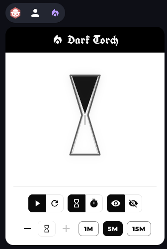
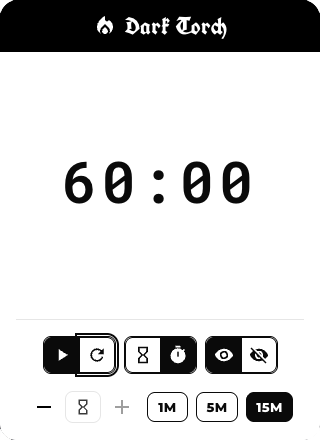

# Dark Torch

Bring the light source mechanic from the
[Shadowdark RPG](https://www.thearcanelibrary.com/collections/shadowdark-rpg/products/shadowdark-rpg)
to your online game!

Dark Torch allows you to easily track real-world torch or light source durations
at the table, seamlessly bringing Shadowdark’s one-hour torch mechanic to your
online game.

This is a lightweight extension for the virtual tabletop platform
[Owlbear Rodeo](https://www.owlbear.rodeo/), designed specifically for
Shadowdark RPG adventures.

## Features

- **Real-time torch countdown:** Timer defaults to one hour, matching Shadowdark
  torch durations.
- **Pause and resume:** The timer can be paused and resumed at any point.
- **Adjust timer:** Modify the remaining time manually, to account for in-game
  changes.
- **Visibility options:** Timer display can be limited to GM only or shown to
  all players.
- **Display modes:** Choose between standard numeric countdown or a thematic
  hourglass visualization.
- **Permission controls:** By default, only the GM can manage the torch timer,
  but this can be configured to allow players.
- **Shadowdark-inspired style:** UI mimics the look and feel of the Shadowdark
  core book.

  
  

## How to install

Check the official
[Owlbear Rodeo Extension Guide](https://extensions.owlbear.rodeo/guide) to know
how to install the extension.

The Dark Torch install link is:
https://davrodpin.github.io/darktorch/manifest.json

## Legal

Dark Torch is not an official Shadowdark product and is not affiliated with or
endorsed by The Arcane Library, LLC. Shadowdark RPG © 2023 The Arcane Library,
LLC.
